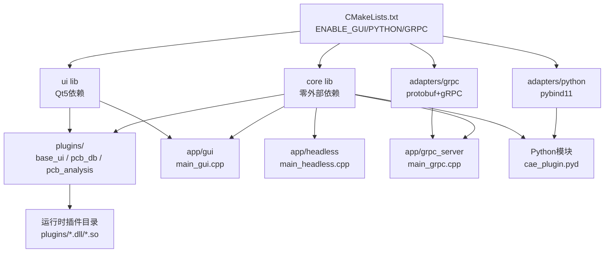

## 用户需求

设计并实现一个支持多模式运行的CAE软件高速PCB插件系统，从零构建完整工程骨架。

## 产品概述

一套基于C++17 + Qt5.13 + CMake的高性能PCB CAE插件框架，支持四种运行模式灵活切换，通过编译期宏与可插拔适配层实现模式隔离，同时提供完整的插件生命周期管理、依赖解析和多种调用接口。

## 核心功能

### 1. 四种运行模式

- **GUI模式**：Qt5主窗口 + 菜单Action系统，完整可视化界面
- **无界面（Headless）模式**：通过 `CAE_ENABLE_GUI` 宏过滤所有UI相关代码，仅运行DB/逻辑插件
- **Python直调模式**：pybind11封装，无需启动主程序，直接脚本调用插件功能
- **gRPC远程调用模式**：protobuf定义服务接口，支持跨进程/跨网络调用插件

### 2. 插件系统

- 三种插件类型：纯UI插件（UI_ONLY）、纯DB插件（DB_ONLY）、混合型插件（HYBRID）
- 自动发现机制：扫描指定目录下的 `.dll`/`.so` 动态库，调用 `createPlugin()` 导出函数加载
- 依赖关系解析：Kahn拓扑排序算法，确保依赖插件先于被依赖插件初始化
- 插件元信息系统：名称、版本、类型、依赖列表

### 3. 公共抽象接口

- `IPlugin`：插件基类，含初始化/关闭/兼容性检查
- `IAction`：统一Action接口，跨UI/Python/gRPC调用复用
- `IDBEngine`：数据库操作抽象接口
- `ActionDispatcher`：统一分发，屏蔽调用来源差异

### 4. 可插拔适配层

- Python适配器：pybind11模块，导出插件管理器和Action接口
- gRPC适配器：PluginService proto定义，PluginServiceImpl服务端实现，GrpcClient客户端
- UI适配器：UIActionBridge将Qt菜单Action桥接到IAction

### 5. 工程配置

- CMake顶层 `option()` 开关控制各模式编译
- 跨平台兼容（Windows/Linux）
- 内置三个示范插件：BaseUI插件、PCBDatabase插件、PCBAnalysis混合插件
- 单元测试骨架（插件管理器 + 依赖排序）

## 技术栈

| 层次 | 技术选型 |
| --- | --- |
| 语言标准 | C++17 |
| UI框架 | Qt 5.13（仅GUI模式依赖） |
| 构建系统 | CMake 3.16+ |
| Python绑定 | pybind11 |
| RPC框架 | gRPC + protobuf 3 |
| 动态加载 | QLibrary（GUI模式）/ dlopen+LoadLibrary（无Qt模式） |
| 测试框架 | Google Test（可选，骨架预留） |
| 编译器 | MSVC 2019+ / GCC 9+ / Clang 10+ |


---

## 实现策略

### 分层解耦架构

采用**三层 + 适配层**设计：

```
┌─────────────────────────────────────────────────────┐
│  App Entry Points (app/)                            │
│  gui | headless | grpc_server | python_module       │
├─────────────────────────────────────────────────────┤
│  Adapters (adapters/)  — 可插拔，编译期开关         │
│  PythonAdapter  |  GrpcAdapter  |  UIActionBridge   │
├─────────────────────────────────────────────────────┤
│  UI Layer (ui/)  — #ifdef CAE_ENABLE_GUI 保护       │
│  MainWindow | MenuActionSystem                      │
├─────────────────────────────────────────────────────┤
│  Core (core/)  — 零外部依赖                         │
│  IPlugin | IAction | PluginManager | ActionDispatch │
└─────────────────────────────────────────────────────┘
         ↑ 插件实现依赖 Core 接口
    plugins/  base_ui | pcb_db | pcb_analysis
```

**关键决策**：

1. **core 库零依赖**：不引入 Qt/Python/gRPC 任何头文件，使 Headless/Python/gRPC 模式无需完整 Qt 安装
2. **动态库插件**：每个插件编译为独立 `.dll`/`.so`，通过 `createPlugin()` C导出函数实例化，避免符号冲突
3. **IAction 统一入口**：所有调用路径（Qt 菜单点击 / Python 脚本调用 / gRPC 请求）最终都路由到同一 `ActionDispatcher::dispatch()`，确保行为一致
4. **编译期模式隔离**：CMake `option()` → `target_compile_definitions()` → `#ifdef` 三层联动，避免运行时条件分支膨胀

---

## 实现要点

### CMake 模块化

- 顶层 `CMakeLists.txt` 统一管理 `ENABLE_GUI / ENABLE_PYTHON / ENABLE_GRPC` 三个 option
- `cmake/PluginHelpers.cmake` 提供 `add_cae_plugin()` 宏，统一插件编译规则（位置无关代码、输出目录、install规则）
- `cmake/CompilerOptions.cmake` 集中配置 C++17、警告级别、跨平台预处理宏

### 插件发现与依赖排序

- `PluginManager::discover(path)` 遍历目录，`QLibrary`（GUI模式）或平台原生API（非GUI）加载 `.dll`/`.so`
- 每个插件库必须导出 `extern "C" IPlugin* createPlugin()` 和 `extern "C" void destroyPlugin(IPlugin*)`
- Kahn算法拓扑排序：构建入度表 → BFS → 检测环形依赖（抛出异常）

### 跨平台动态加载兼容

```cpp
// core/src/DynamicLoader.cpp — 统一封装
#ifdef _WIN32
  HMODULE handle = LoadLibraryW(path);
  auto sym = GetProcAddress(handle, "createPlugin");
#else
  void* handle = dlopen(path, RTLD_LAZY);
  auto sym = dlsym(handle, "createPlugin");
#endif
```

### gRPC 代码生成集成

`cmake/FindgRPC.cmake` 中封装 `protobuf_generate_grpc_cpp()` 调用，生成代码输出到 `${CMAKE_BINARY_DIR}/generated/`，避免污染源码目录

### Python 模块导出

Python 模式下编译为 `cae_plugin.pyd`（Windows）/ `cae_plugin.so`（Linux），通过 `PYBIND11_MODULE` 导出 `PluginManager` 和 `IAction` 的 Python 包装类

---

## 架构设计



---

## 目录结构

```
test-plugin/
├── CMakeLists.txt                          # [NEW] 顶层CMake，option开关+子目录管理
├── cmake/
│   ├── CompilerOptions.cmake               # [NEW] C++17、警告、跨平台宏定义
│   ├── PluginHelpers.cmake                 # [NEW] add_cae_plugin()宏定义
│   ├── FindQt5.cmake                       # [NEW] Qt5查找辅助（可选覆盖）
│   └── FindgRPC.cmake                      # [NEW] gRPC+protobuf查找与代码生成封装
│
├── core/
│   ├── CMakeLists.txt                      # [NEW] 编译core静态库，零外部依赖
│   ├── include/core/
│   │   ├── IPlugin.h                       # [NEW] 插件基接口：getMeta/initialize/shutdown/isCompatible
│   │   ├── IPluginManager.h                # [NEW] 插件管理器接口：discover/load/getPlugin
│   │   ├── IAction.h                       # [NEW] 统一Action接口：getId/getLabel/execute/isEnabled
│   │   ├── IDBEngine.h                     # [NEW] DB引擎抽象接口
│   │   ├── PluginMeta.h                    # [NEW] PluginMeta结构体+PluginType枚举
│   │   ├── PluginRegistry.h                # [NEW] 全局插件注册表（单例）
│   │   ├── ActionContext.h                 # [NEW] Action执行上下文（参数包）
│   │   └── RunMode.h                       # [NEW] RunMode枚举：GUI/HEADLESS/PYTHON/GRPC
│   └── src/
│       ├── PluginManager.cpp               # [NEW] 自动发现+Kahn拓扑排序+生命周期管理
│       ├── PluginRegistry.cpp              # [NEW] 注册表实现
│       ├── ActionDispatcher.cpp            # [NEW] 统一Action分发（按ID路由到IAction::execute）
│       └── DynamicLoader.cpp               # [NEW] 跨平台动态库加载封装（Win/Linux）
│
├── adapters/
│   ├── CMakeLists.txt                      # [NEW] 按option控制子模块
│   ├── python/
│   │   ├── CMakeLists.txt                  # [NEW] pybind11模块，ENABLE_PYTHON守护
│   │   ├── include/adapters/python/
│   │   │   └── PythonAdapter.h             # [NEW] Python适配器接口声明
│   │   └── src/
│   │       ├── PythonAdapter.cpp           # [NEW] pybind11 PYBIND11_MODULE导出PluginManager/IAction
│   │       └── PyPluginBridge.cpp          # [NEW] Python->IAction调用桥接，参数类型转换
│   └── grpc/
│       ├── CMakeLists.txt                  # [NEW] gRPC模块，ENABLE_GRPC守护+proto代码生成
│       ├── proto/
│       │   └── plugin_service.proto        # [NEW] PluginService服务定义：LoadPlugin/ExecuteAction/ListPlugins
│       ├── include/adapters/grpc/
│       │   └── GrpcAdapter.h               # [NEW] gRPC适配器接口
│       └── src/
│           ├── GrpcAdapter.cpp             # [NEW] gRPC服务器启动/停止封装
│           ├── PluginServiceImpl.cpp       # [NEW] PluginService RPC方法实现（委托给PluginManager/ActionDispatcher）
│           └── GrpcClient.cpp              # [NEW] gRPC客户端（用于测试和远程调用示例）
│
├── ui/
│   ├── CMakeLists.txt                      # [NEW] Qt5依赖，ENABLE_GUI守护
│   ├── include/ui/
│   │   ├── IUIPlugin.h                     # [NEW] UI插件扩展接口：setupUI/getMenuContributions
│   │   ├── MainWindow.h                    # [NEW] 主窗口类声明
│   │   ├── MenuActionSystem.h              # [NEW] 菜单Action系统：注册/查找/触发菜单项
│   │   └── UIActionBridge.h                # [NEW] QAction->IAction适配桥接
│   └── src/
│       ├── MainWindow.cpp                  # [NEW] QMainWindow实现，集成MenuActionSystem
│       ├── MenuActionSystem.cpp            # [NEW] 动态菜单构建，插件注册菜单项
│       └── UIActionBridge.cpp              # [NEW] QAction::triggered信号连接到IAction::execute
│
├── plugins/
│   ├── CMakeLists.txt                      # [NEW] 管理三个内置插件子目录
│   ├── base_ui/
│   │   ├── CMakeLists.txt                  # [NEW] add_cae_plugin(base_ui UI_ONLY)
│   │   ├── include/BaseUIPlugin.h          # [NEW] BaseUIPlugin类声明（实现IUIPlugin）
│   │   └── src/BaseUIPlugin.cpp            # [NEW] 主界面布局+菜单贡献实现，isCompatible仅GUI返回true
│   ├── pcb_db/
│   │   ├── CMakeLists.txt                  # [NEW] add_cae_plugin(pcb_db DB_ONLY)
│   │   └── src/PCBDBPlugin.cpp             # [NEW] PCB数据库操作插件，实现IDBEngine，无UI依赖
│   └── pcb_analysis/
│       ├── CMakeLists.txt                  # [NEW] add_cae_plugin(pcb_analysis HYBRID)，依赖pcb_db
│       └── src/PCBAnalysisPlugin.cpp       # [NEW] 混合型插件：注册分析Action，GUI模式下额外提供UI面板
│
├── app/
│   ├── CMakeLists.txt                      # [NEW] 按option选择编译的可执行目标
│   ├── gui/
│   │   └── main_gui.cpp                    # [NEW] GUI入口：QApplication+MainWindow+PluginManager
│   ├── headless/
│   │   └── main_headless.cpp               # [NEW] 无界面入口：仅PluginManager(HEADLESS模式)，支持命令行参数
│   └── grpc_server/
│       └── main_grpc.cpp                   # [NEW] gRPC服务入口：PluginManager+GrpcAdapter启动服务器
│
└── tests/
    ├── CMakeLists.txt                      # [NEW] GTest集成，链接core库
    ├── test_plugin_manager.cpp             # [NEW] 测试插件发现、加载、卸载流程
    └── test_dependency_sort.cpp            # [NEW] 测试Kahn拓扑排序：正常依赖链、环形依赖异常
```

---

## 关键代码结构

### RunMode.h

```cpp
#pragma once
enum class RunMode { GUI, HEADLESS, PYTHON, GRPC };
```

### IPlugin.h

```cpp
#pragma once
#include "PluginMeta.h"
#include "RunMode.h"

class IPlugin {
public:
    virtual ~IPlugin() = default;
    virtual PluginMeta getMeta() const = 0;
    virtual bool initialize(RunMode mode) = 0;
    virtual void shutdown() = 0;
    virtual bool isCompatible(RunMode mode) const = 0;
};

// 每个插件动态库必须导出：
extern "C" IPlugin* createPlugin();
extern "C" void destroyPlugin(IPlugin*);
```

### IAction.h

```cpp
#pragma once
#include "ActionContext.h"
#include <string>

class IAction {
public:
    virtual ~IAction() = default;
    virtual std::string getId() const = 0;
    virtual std::string getLabel() const = 0;
    virtual void execute(const ActionContext& ctx) = 0;
    virtual bool isEnabled() const = 0;
};
```

### PluginMeta.h

```cpp
#pragma once
#include <string>
#include <vector>

enum class PluginType { UI_ONLY, DB_ONLY, HYBRID };

struct PluginMeta {
    std::string name;
    std::string version;
    PluginType  type;
    std::vector<std::string> dependencies;
};
```

### plugin_service.proto（核心片段）

```
syntax = "proto3";
package cae;

service PluginService {
  rpc LoadPlugin    (LoadPluginRequest)    returns (LoadPluginResponse);
  rpc ExecuteAction (ExecuteActionRequest) returns (ExecuteActionResponse);
  rpc ListPlugins   (ListPluginsRequest)   returns (ListPluginsResponse);
}
```

## 使用的 Agent Extensions

### MCP: GitHub MCP Server

- **Purpose**: 将生成的所有工程骨架文件（CMakeLists、头文件、源文件、proto文件等）通过 `push_files` 批量提交到 GitHub 仓库，并通过 `create_repository` 创建项目仓库
- **Expected outcome**: 完整的工程骨架代码托管在 GitHub 仓库，包含所有目录结构、CMake配置、接口头文件、源文件骨架及 README，可直接 clone 后用 CMake 配置构建